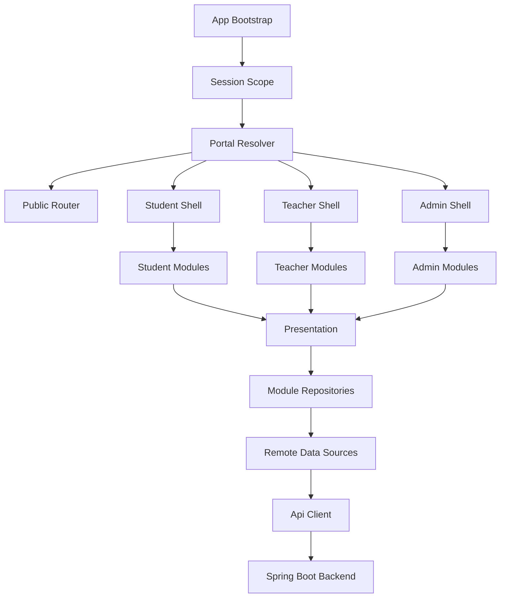

# Feature Design

## Overview

当前 Flutter 客户端的主要问题不是单页功能不够，而是工程结构不适合承载多角色、多模块、强权限的实验室平台。

现状特征：

- 业务模型集中在全局 `models/`
- 仓库集中在全局 `repositories/`
- 应用入口靠一个 `MainShellPage` 承载
- 学生、教师、管理员三类门户没有在结构层面被隔离
- 后续如果继续往里塞模块，会快速演变成“大页面 + 大仓库 + 大控制器”的典型屎山

因此，这次全量对接不应继续沿用当前扁平结构，而应重构为：

- 领域垂直切分
- 角色门户组装
- 轻量分层
- 跨平台自适应导航

本设计采用 `Vertical Slice + Portal Shell + Lightweight Clean Architecture`。

设计目标：

- 能承载学生、教师、管理员、超级管理员四类身份
- 能按后端控制器完整映射业务模块
- 能让每个模块独立演进，不污染全局
- 能在移动端、桌面端和 Web 端保持一致的业务结构
- 不引入为了“看起来高级”而没有价值的过度抽象

非目标：

- 不做传统教科书式三十层 clean architecture
- 不为简单 CRUD 强行引入 use case、mapper、service、facade 全家桶
- 不继续保留公开调试入口、Web 回退提示和占位页面

## Architecture

### High-Level Architecture



### Layering Strategy

采用“轻量分层”，不是机械分层。

每个模块默认具备以下层次：

- `presentation`
  - 页面、组件、状态控制器、交互逻辑
- `data`
  - DTO、远程数据源、仓库实现
- `domain`
  - 仅在存在真实业务编排、权限决策、状态聚合时引入

具体约束：

- 简单分页查询模块可以只有 `presentation + data`
- 涉及多接口聚合、复杂状态转换、跨角色行为差异的模块必须有 `domain`
- 公共能力只进 `core` 或 `shared`，不再把业务模型塞进全局目录

## Proposed Project Structure

```text
lib/src/
  app/
    bootstrap/
      app_bootstrap.dart
      app_dependencies.dart
    router/
      app_router.dart
      route_guards.dart
      portal_resolver.dart
    shells/
      public_shell.dart
      student_shell.dart
      teacher_shell.dart
      admin_shell.dart
  core/
    network/
      api_client.dart
      auth_interceptor.dart
      api_exception.dart
      upload_client.dart
    storage/
      session_storage.dart
    auth/
      session_scope.dart
      auth_session.dart
    error/
      app_failure.dart
      failure_mapper.dart
    theme/
      app_theme.dart
      app_tokens.dart
    files/
      file_resolver.dart
      file_opener.dart
    pagination/
      paged_query.dart
      paged_response.dart
  shared/
    widgets/
    layout/
    extensions/
    utils/
  portals/
    student/
      student_home_config.dart
      student_navigation.dart
    teacher/
      teacher_home_config.dart
      teacher_navigation.dart
    admin/
      admin_home_config.dart
      admin_navigation.dart
  modules/
    auth/
    profile/
    colleges/
    labs/
    notices/
    recruit/
    lab_apply/
    workspace/
    attendance_workflow/
    delivery/
    equipment/
    growth_center/
    grad_path/
    written_exam/
    forum/
    guide/
    lab_create_apply/
    admin_management/
    statistics/
    graduate/
```

### Why This Structure Fits The Project

- `app/` 只放应用级装配，不放业务
- `portals/` 负责“谁看到什么”，不负责“怎么请求接口”
- `modules/` 负责单一业务域，不互相污染
- `core/` 只沉淀基础设施
- `shared/` 只放纯共享 UI 与工具，不放领域对象

这比当前扁平结构强的地方在于：

- 学生端和管理员端不会共用一个巨型首页
- `workspace`、`attendance_workflow`、`delivery` 这类复杂模块可以独立演进
- 后端新增控制器时，能明确归入哪个模块，而不是继续往全局 `repositories/` 追加文件

## State Management And Dependency Injection

### Recommendation

正式重构阶段建议切到：

- `flutter_riverpod`
- `go_router`
- 保留 `dio`

原因：

- 当前 `provider + 直接注入 controller` 适合小应用，不适合多角色路由守卫和模块级依赖
- `go_router` 更适合做鉴权跳转、深链接和桌面/Web 路由同步
- `riverpod` 更适合做模块内 provider 隔离、异步状态组合和测试替换

### State Rules

- 全局状态只保留：
  - 当前会话
  - 当前用户档案
  - 当前门户
  - 全局主题/环境
- 模块状态留在模块内部，不允许跨模块直接读写页面状态
- 写操作统一通过 action provider / notifier 执行
- 列表、详情、分页、筛选各自独立 provider，不用一个 controller 包全部状态

### Provider Example Pattern

单模块推荐模式：

- `xxx_remote_data_source_provider`
- `xxx_repository_provider`
- `xxx_list_controller_provider`
- `xxx_detail_controller_provider`
- `xxx_action_controller_provider`

这样既避免全局单例泛滥，也避免一个控制器承载所有状态。

## Routing Design

### Route Domains

路由按门户划分，而不是按底部标签划分。

公共路由：

- `/login`
- `/register/student`
- `/register/teacher`
- `/password-reset`

学生门户：

- `/student/dashboard`
- `/student/labs`
- `/student/labs/:id`
- `/student/recruit/plans`
- `/student/applications`
- `/student/workspace/overview`
- `/student/workspace/attendance`
- `/student/workspace/files`
- `/student/delivery`
- `/student/equipment`
- `/student/growth`
- `/student/grad-path`
- `/student/written-exam`
- `/student/notices`
- `/student/forum`
- `/student/profile`

教师门户：

- `/teacher/dashboard`
- `/teacher/lab-create-applies`
- `/teacher/workspace/overview`
- `/teacher/workspace/attendance`
- `/teacher/workspace/files`
- `/teacher/notices`
- `/teacher/profile`

管理门户：

- `/admin/dashboard`
- `/admin/colleges`
- `/admin/labs`
- `/admin/admin-management`
- `/admin/recruit/plans`
- `/admin/applications`
- `/admin/members`
- `/admin/notices`
- `/admin/statistics`
- `/admin/attendance/tasks`
- `/admin/attendance/summary`
- `/admin/lab-create-applies`
- `/admin/teacher-register-applies`
- `/admin/delivery`
- `/admin/equipment`
- `/admin/growth/question-bank`
- `/admin/written-exam`
- `/admin/graduate`
- `/admin/profile`

### Guard Strategy

路由守卫使用统一门户解析：

1. 启动后读取本地会话
2. 使用 `/api/access/profile` 刷新用户画像
3. 基于 `primaryIdentity`、`role`、`labManager`、`schoolDirector` 等字段解析门户
4. 根据目标路由判断是否允许进入
5. 401/403 时执行回退或退出登录

### Adaptive Navigation

窄屏：

- 使用底部导航 + 二级页面入栈

宽屏：

- 使用 `NavigationRail` + 内容区

桌面/Web：

- 管理类模块优先采用主从布局
- 列表与详情同屏，减少跳转层级

## Portal Shell Design

### Student Shell

学生端不适合把所有功能塞进 5 个 tab。

推荐主导航：

- 工作台
- 实验室
- 在组空间
- 服务中心
- 我的

职责划分：

- 工作台：概览、公告、待办、近期状态
- 实验室：实验室浏览、招新计划、申请
- 在组空间：我的实验室、考勤、资料空间、退出申请
- 服务中心：投递、设备、成长、毕业去向、笔试、论坛、指南
- 我的：档案、简历、设置

### Teacher Shell

推荐主导航：

- 工作台
- 创建申请
- 实验室工作台
- 公告
- 我的

### Admin Shell

推荐主导航：

- 工作台
- 审批中心
- 实验室管理
- 运营中心
- 我的

职责划分：

- 工作台：统计、待办、预警、最新动态
- 审批中心：成员申请、实验室创建、教师注册、退出申请、投递审核
- 实验室管理：学院、实验室、管理员、成员、公告、招新
- 运营中心：考勤任务、统计、设备、题库、优秀毕业生

## Module Design

### Standard Module Template

```text
modules/
  notices/
    data/
      dto/
      notices_remote_data_source.dart
      notices_repository_impl.dart
    domain/
      notice_entity.dart
      notices_repository.dart
    presentation/
      controllers/
      pages/
      widgets/
```

### Module Classification

#### Type A: Simple CRUD Modules

适用模块：

- `colleges`
- `notices`
- `graduate`

结构：

- `presentation + data`

不必强行加复杂 domain。

#### Type B: Paginated Workflow Modules

适用模块：

- `lab_apply`
- `lab_create_apply`
- `teacher_register_applies`
- `delivery`
- `equipment`

结构：

- `presentation + data + minimal domain`

domain 只处理状态枚举、权限动作和表单规则。

#### Type C: Aggregated Workspace Modules

适用模块：

- `workspace`
- `attendance_workflow`
- `statistics`
- `growth_center`
- `written_exam`

结构：

- `presentation + data + domain`

这些模块通常需要：

- 多接口聚合
- 复杂状态映射
- 多角色行为差异
- 较强的页面间协同

## Backend To Module Mapping

### Auth And Session

- `AuthController` -> `modules/auth`
- `AccessProfileController` -> `modules/profile` + `app/router/portal_resolver`
- `UserController` -> `modules/profile`、`modules/admin_management`

### Public Base Data

- `CollegeController` -> `modules/colleges`
- `LabController` -> `modules/labs`
- `NoticeController` -> `modules/notices`
- `FileUploadController` -> `core/files` + 具体模块上传服务

### Student Core

- `RecruitPlanController` -> `modules/recruit`
- `LabApplyController` -> `modules/lab_apply`
- `LabMemberController` -> `modules/workspace`
- `LabSpaceController` -> `modules/workspace`
- `AttendanceWorkflowController` 学生部分 -> `modules/attendance_workflow`

### Student Extended

- `DeliveryController` -> `modules/delivery`
- `EquipmentController` -> `modules/equipment`
- `GrowthCenterController` -> `modules/growth_center`
- `GradPathController` -> `modules/grad_path`
- `WrittenExamController` 学生部分 -> `modules/written_exam`
- `GuideController` -> `modules/guide`
- `ForumController` -> `modules/forum`

### Teacher

- `LabCreateApplyController` -> `modules/lab_create_apply`
- `AttendanceWorkflowController` 教师部分 -> `modules/attendance_workflow`
- `LabSpaceController` 教师部分 -> `modules/workspace`

### Admin

- `AdminController` -> `modules/admin_management`
- `AdminManagementController` -> `modules/admin_management`
- `StatisticsController` -> `modules/statistics`
- `TeacherRegisterApplyController` -> `modules/lab_create_apply` 或单独 `modules/teacher_register_apply`
- `AttendancePhotoAccessController` -> `modules/attendance_workflow`
- `OutstandingGraduateController` -> `modules/graduate`
- `GrowthCenterController` 管理部分 -> `modules/growth_center`
- `WrittenExamController` 管理部分 -> `modules/written_exam`

## Data Modeling Strategy

### DTO And Entity Separation

规则：

- 与后端 JSON 强绑定的对象叫 DTO
- 供页面消费的对象叫 Entity / ViewModel
- DTO 不跨模块复用
- 共享的不是 DTO，而是基础值对象，例如：
  - `PagedResponse<T>`
  - `AttachmentRef`
  - `UserBrief`
  - `LabBrief`

### Naming Rules

- 后端分页对象统一适配成 `PagedResponse<T>`
- 列表项实体统一以 `Summary` 结尾
- 详情实体统一以 `Detail` 结尾
- 提交表单统一以 `Command` 或 `Payload` 结尾

### Error And Empty State

所有模块统一走：

- `AppFailure`
- `FailureMapper`
- 正式产品文案

禁止出现：

- “当前 Web 端暂未支持”
- “移动端先预留入口”
- “建议去 GitHub issue”
- “接口未实现”

如果后端确实不存在能力：

- 要么移除入口
- 要么放进明确标识为“服务介绍”的静态说明页

## Networking And File Handling

### Api Client

保留 `dio`，但升级职责：

- 统一 `baseUrl`
- 统一鉴权头
- 统一错误映射
- 统一分页参数与空值裁剪
- 统一文件上传
- 统一 401 自动失效处理

### Interceptors

至少需要：

- `AuthInterceptor`
  - 自动附带 token
- `SessionExpiredInterceptor`
  - 401 时通知会话层退出
- `LoggingInterceptor`
  - 仅 debug 构建启用，不暴露给终端用户

### File Strategy

公共文件：

- 通过 `FileUploadController` 返回路径后，用统一 `FileResolver` 拼接地址

受保护文件：

- 使用带鉴权的请求流打开
- 对桌面/Web 和移动端分别封装文件访问能力

上传场景统一抽象为：

- `UploadScene.avatar`
- `UploadScene.resume`
- `UploadScene.spaceFile`
- `UploadScene.attendancePhoto`

## Session And Access Control

### Session Model

统一会话模型应包含：

- token
- userId
- username
- primaryIdentity
- displayRole
- managedLabId
- managedCollegeId
- capability flags

### Capability-Based Rendering

UI 不只根据 `role` 判断，也根据能力位判断。

例如：

- `canManageLab`
- `canReviewApplications`
- `canManageCollege`
- `canViewAttendancePhotos`

这样可以兼容：

- 超级管理员
- 学院负责人
- 实验室管理员
- 教师

而不是把权限全写死在字符串判断里。

## UX And Visual System

### Design Rules

- 不再直接暴露接口地址切换
- 不在正式入口展示 GitHub、Web 端跳转等开发痕迹
- 同角色门户保持一致的信息架构
- 同类型页面使用统一的筛选栏、列表卡片、详情抽屉和操作栏

### Responsive Rules

移动端：

- 强化一级入口
- 弱化表格
- 多用卡片、分组、时间线

桌面/Web：

- 管理类模块优先表格化
- 列表详情并排
- 操作批量化

### Screenshot-Driven Profile Alignment

“我的”页要参考用户提供的截图风格，但需要做产品化升级：

- 顶部渐变头图
- 白色卡片分组
- 简洁图标 + 文本 + 箭头
- 与真实后端能力对齐

其中：

- “我的简历”保留并对接真实接口
- “设置”保留
- “帮助与反馈”做正式帮助中心
- “生物信息采集 / 我收藏的 / 我反馈的”在后端未提供能力前，不纳入主业务宣称范围

## Migration Plan

### Phase 1: Foundation Refactor

- 建立 `app/core/shared/portals/modules` 目录骨架
- 引入 `go_router` 与 `riverpod`
- 重建 session scope、portal resolver、route guards
- 保留现有 `dio` 与存储逻辑，逐步迁移

### Phase 2: Public And Shared Modules

- 迁移 `auth`
- 迁移 `profile`
- 迁移 `labs`
- 迁移 `notices`
- 迁移 `recruit`

### Phase 3: Student Core Modules

- 完成 `lab_apply`
- 完成 `workspace`
- 完成 `attendance_workflow`

这是学生端最核心闭环。

### Phase 4: Teacher Portal

- 完成 `lab_create_apply`
- 完成教师工作台与实验室空间

### Phase 5: Admin Core Modules

- 完成 `statistics`
- 完成 `admin_management`
- 完成审批中心
- 完成管理类公告、招新、成员、实验室模块

### Phase 6: Student Extended Modules

- `delivery`
- `equipment`
- `growth_center`
- `grad_path`
- `written_exam`
- `forum`
- `guide`

### Phase 7: Cross-Platform Polish

- 宽屏适配
- 文件打开与下载
- 表单体验统一
- 空态/错态统一
- 真机联调

## Testing Strategy

### Unit Tests

- DTO 解析
- 分页映射
- 权限解析
- 门户路由守卫
- 关键 action controller

### Integration Tests

- 登录到门户跳转
- 学生申请提交流程
- 资料上传流程
- 管理审批流程

### Manual Validation Matrix

按角色验证：

- 学生
- 教师
- 管理员
- 超级管理员

按平台验证：

- Android
- iOS
- Web
- Windows/macOS

按链路验证：

- 登录注册
- 基础资料
- 核心业务
- 文件上传/预览
- 权限受限场景

## Risks And Mitigations

### Risk 1: Current Flat Code Continues To Grow

风险：

- 如果边补功能边沿用现结构，重构成本会越来越高

处理：

- 先做基础骨架重构，再迁移业务模块

### Risk 2: Backend Role Semantics Are Mixed

风险：

- 后端存在 `role`、`primaryIdentity`、`labManager`、`schoolDirector` 等并行权限语义

处理：

- 建立统一 `PortalResolver + CapabilityResolver`

### Risk 3: File And Protected Resource Access Differs By Platform

风险：

- Web、移动端、桌面端的文件访问策略不一样

处理：

- 单独抽象 `FileResolver` 与 `FileOpener`

### Risk 4: Too Much Ceremony Slows Delivery

风险：

- 如果每个模块都上重型 clean architecture，交付速度会失控

处理：

- 采用轻量分层，只在复杂模块引入 domain

## Decision Summary

最终架构决策如下：

- 放弃继续扩展当前扁平结构
- 重构为 `app + core + shared + portals + modules`
- 按角色建立独立 shell
- 按领域垂直切模块
- 采用 `riverpod + go_router + dio`
- 用轻量分层替代过度工程化 clean architecture
- 以后端控制器和 Web 端角色路由作为唯一功能边界

这套结构适合你这个项目继续做“全量对接”，也能避免后面把 Flutter 客户端写成一坨很难维护的业务堆。

